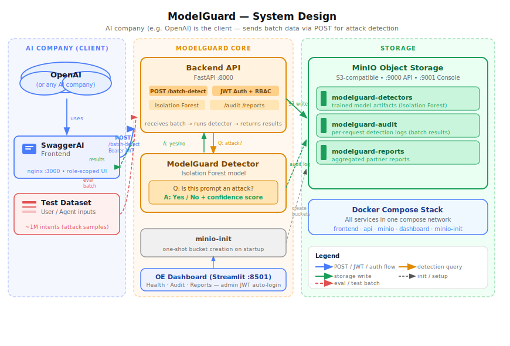

# ModelGuard AI

ModelGuard AI detects model theft by analyzing batches of query logs submitted by AI company partners, identifying users whose query behavior matches known model-extraction patterns.

> **Version:** 0.3.0-oss

---

## What It Does

AI companies (partners) periodically submit a window of their API query logs — typically one hour of production traffic — to ModelGuard. For each batch, ModelGuard:

1. Computes **per-user behavioral features** across all queries in the batch (query volume, input diversity, output coverage, entropy patterns).
2. Runs an **Isolation Forest** detector to score each user 0–100 for model theft likelihood.
3. Returns a **batch risk assessment** with per-user risk levels (`LOW / MEDIUM / HIGH / CRITICAL`).
4. Stores a **theft report** in MinIO for every HIGH or CRITICAL batch.

Each query record submitted contains: `query_id`, `query_user`, `input`, `output`.

Access to the API is controlled by **JWT-based role-based access control**. Partners log in once at `POST /auth/login` and use the returned Bearer token on all subsequent calls.

---

## Architecture



### Detection Pipeline

Every call to `POST /batch/analyze` runs:

```
Incoming batch (partner_id + list of {query_id, query_user, input, output})
     │
     ├─ 1. JWT verification + role check
     │
     ├─ 2. Per-user feature extraction
     │        query_count · unique_input_ratio · avg_input_length
     │        input_entropy · output_diversity
     │
     ├─ 3. Isolation Forest inference (per user)
     │        → anomaly flag · risk score 0–100 · risk level LOW/MEDIUM/HIGH/CRITICAL
     │        → batch risk level = max across all users
     │
     ├─ 4. Batch audit record → MinIO  modelguard-auditlog  (every batch)
     │
     ├─ 5. Theft report → MinIO  modelguard-reports  (HIGH / CRITICAL only, background)
     │
     └─ 6. JSON response returned to caller
```

### Containers

| Container | Port | Role |
|---|---|---|
| `backend` | 8000 | FastAPI detection engine — JWT auth + RBAC, Isolation Forest, MinIO writes |
| `frontend` | 3000 | SwaggerAI — serves role-scoped OpenAPI spec after JWT login |
| `oe-dashboard` | 8501 | Operations/Engineering dashboard — auto-logins as admin |
| `minio` | 9000 / 9001 | S3-compatible object storage for detector models, audit logs, and theft reports |
| `minio-init` | — | One-shot bootstrap — creates the three MinIO buckets, then exits |

---

## Authentication

All endpoints except `GET /health` and `POST /auth/login` require a `Bearer` JWT token.

### 1. Log in

```bash
curl -s -X POST http://localhost:8000/auth/login \
  -d "username=partner1&password=partner_password" | jq .
# → { "access_token": "...", "token_type": "bearer", "role": "partner", "username": "partner1" }
```

### 2. Demo users

| Username | Role | Permitted endpoints |
|---|---|---|
| `analyst1` | `analyst` | Read-only: `/audit/*`, `/reports/*` |
| `partner1` | `partner` | `POST /batch/analyze`, own audits + reports |
| `admin` | `admin` | All endpoints |

> **Production note:** Replace demo credentials via environment variables and set a strong `JWT_SECRET_KEY`.

### 3. Role-scoped OpenAPI specs

| Endpoint | Served to |
|---|---|
| `/openapi-analyst.json` | `analyst` |
| `/openapi-partner.json` | `partner` |
| `/openapi-admin.json` | `admin` |
| `/openapi-public.json` | unauthenticated (only `/health`) |

---

## CI/CD Pipeline

The repository ships with two GitHub Actions workflows:

| Workflow | File | Trigger | Purpose |
|---|---|---|---|
| **CI** | `.github/workflows/ci.yml` | Push to `main` / `dev`, PRs to `main` | Type-check, unit tests, integration tests |
| **CD** | `.github/workflows/cd.yml` | Push to `main` only | Build Docker images and publish to GHCR |

### Job flow

```
Push to dev / PR to main          Push to main
        │                                │
        ▼                                ▼
  [typecheck] ──► [unit] ──► [integration]      [build-and-push]
   tsc --noEmit   pure logic   Docker Compose    backend · frontend · oe-dashboard
                  no server    full stack test   → ghcr.io/i-sheng/modelguard-*:latest
                                                 → ghcr.io/i-sheng/modelguard-*:<sha>
```

### Required GitHub Secrets

Go to **Settings → Secrets and variables → Actions** and add:

| Secret | Description |
|---|---|
| `MINIO_ROOT_USER` | MinIO root username |
| `MINIO_ROOT_PASSWORD` | MinIO root password |
| `MINIO_ACCESS_KEY` | MinIO access key |
| `MINIO_SECRET_KEY` | MinIO secret key |
| `JWT_SECRET_KEY` | HS256 signing secret |
| `OE_ADMIN_USER` | OE dashboard admin username |
| `OE_ADMIN_PASSWORD` | OE dashboard admin password |
| `ANALYST1_PASSWORD` | Password for the `analyst1` demo user |
| `PARTNER1_PASSWORD` | Password for the `partner1` demo user |
| `ADMIN_PASSWORD` | Password for the `admin` demo user |

> `GITHUB_TOKEN` is provided automatically by GitHub Actions — no setup needed for GHCR pushes.

### Running tests locally

```bash
cd tests
bun install

# Unit tests only (no Docker needed)
bunx jest unit.test.ts

# All tests (requires: docker compose up)
bun run test
```

### Deploying with pre-built GHCR images

After a successful merge to `main`, the CD workflow publishes three images to GHCR. To run the stack using those images instead of building locally:

```bash
# Pull the latest images
docker pull ghcr.io/i-sheng/modelguard-backend:latest
docker pull ghcr.io/i-sheng/modelguard-frontend:latest
docker pull ghcr.io/i-sheng/modelguard-oe-dashboard:latest

# Start with the production overlay (uses GHCR images, no local build)
docker compose -f docker-compose.yml -f docker-compose.prod.yml up -d
```

To pin a deployment to a specific commit SHA:

```bash
# Replace <sha> with the full commit hash from the CD run
docker compose -f docker-compose.yml -f docker-compose.prod.yml up -d \
  --env-file .env \
  -e BACKEND_IMAGE=ghcr.io/i-sheng/modelguard-backend:<sha>
```

Or edit `docker-compose.prod.yml` to replace `:latest` with `:<sha>` before deploying.

---

## Quick Start

> **No local installs required.** Everything runs inside containers.

### Prerequisites

- [Docker](https://docs.docker.com/get-docker/) with Compose v2 (`docker compose`)

### 1. Clone and start

```bash
git clone git@github.com:I-Sheng/ModelGuard.git
cd ModelGuard
docker compose up --build
```

### 2. Open the services

| URL | What |
|---|---|
| http://localhost:3000 | SwaggerAI frontend — submit batches, view reports |
| http://localhost:8501 | OE Dashboard — health, audit logs, theft reports |
| http://localhost:8000/docs | Raw FastAPI Swagger UI (internal dev) |
| http://localhost:9001 | MinIO Console — username/password: `minioadmin` |

### 3. Seed demo data

```bash
docker compose exec backend python seed_history.py
```

### 4. Run the smoke-test

```bash
bash demo.sh
```

Submits a demo batch for `openai-demo`, then lists audit logs and theft reports.

### 5. Tear down

```bash
docker compose down          # stop containers, keep MinIO data volume
docker compose down -v       # stop containers AND delete MinIO data
```

---

## Configuration

Copy `.env.example` to `.env` to override defaults:

```bash
cp .env.example .env
```

| Variable | Default | Description |
|---|---|---|
| `MINIO_ROOT_USER` | `minioadmin` | MinIO root username |
| `MINIO_ROOT_PASSWORD` | `minioadmin` | MinIO root password |
| `MINIO_ENDPOINT` | `minio:9000` | Internal MinIO endpoint (service name) |
| `JWT_SECRET_KEY` | `modelguard-dev-secret-change-in-production` | HS256 signing secret — **change this in production** |
| `OE_ADMIN_USER` | `admin` | Username the OE dashboard uses to authenticate with the backend |
| `OE_ADMIN_PASSWORD` | `admin_password` | Password for `OE_ADMIN_USER` |

---

## Project Structure

```
ModelGuard/
├── docker-compose.yml        # Orchestrates all five services
├── docker-compose.prod.yml   # Production overlay — uses GHCR images instead of local builds
├── .env.example              # Environment variable template
├── demo.sh                   # Smoke-test script
├── .github/
│   └── workflows/
│       ├── ci.yml            # CI: typecheck → unit tests → integration tests
│       └── cd.yml            # CD: build + push Docker images to GHCR (main only)
├── api/                      # FastAPI detection backend
│   ├── Dockerfile
│   ├── main.py
│   ├── seed_history.py
│   └── requirements.txt
├── frontend/                 # SwaggerAI frontend (nginx + Swagger UI)
│   ├── Dockerfile
│   ├── index.html
│   └── nginx.conf
├── oe-dashboard/             # Operations/Engineering dashboard (Streamlit)
│   ├── Dockerfile
│   ├── app.py
│   └── requirements.txt
├── tests/                    # TypeScript test suite (Jest + Bun)
│   ├── unit.test.ts          # Pure unit tests — no server needed
│   ├── functional.test.ts    # RBAC + auth integration tests
│   └── security.test.ts      # Known-vulnerability tests (T-01 – T-03)
├── images/
│   └── modelguard_system_design.svg
├── README.md
└── docs/
```

---

## MinIO Buckets

| Bucket | Content | Written by |
|---|---|---|
| `modelguard-detectors` | Trained Isolation Forest model files | Backend at startup (persisted) |
| `modelguard-auditlog` | Every batch analysis audit record | `POST /batch/analyze` (always) |
| `modelguard-reports` | Theft reports for HIGH/CRITICAL batches | `POST /batch/analyze` (background task) |

---

## API Endpoints

| Method | Path | Auth | Role | Description |
|---|---|---|---|---|
| `POST` | `/auth/login` | No | — | Issue a JWT for a valid username/password |
| `GET` | `/auth/me` | Yes | any | Return the current user's identity and role |
| `GET` | `/health` | No | — | Public liveness probe — returns `{"status":"ok"}` |
| `GET` | `/health/detail` | Yes | any | Full health: API, MinIO, Isolation Forest, Frontend |
| `GET` | `/stats` | No | — | Aggregated system stats for the OE Dashboard |
| `POST` | `/batch/analyze` | Yes | partner, admin | Submit a batch of query records for theft analysis |
| `GET` | `/batch/{batch_id}` | Yes | partner, admin | Retrieve the result for a previously analyzed batch |
| `GET` | `/audit/{partner_id}` | Yes | partner, analyst, admin | List batch audit records (optionally filtered by date) |
| `GET` | `/reports/{partner_id}` | Yes | partner, analyst, admin | List HIGH/CRITICAL theft reports |
| `GET` | `/reports/{partner_id}/{key}` | Yes | partner, analyst, admin | Fetch full content of a theft report |

---

## Detection Method

An **Isolation Forest** trained on synthetic normal-user data scores each user in the submitted batch on five features:

| Feature | Description |
|---|---|
| `query_count` | Total queries by this user in the batch window |
| `unique_input_ratio` | Distinct inputs / total queries (low = repetitive probing) |
| `avg_input_length` | Mean character count of the user's inputs |
| `input_entropy` | Mean Shannon entropy of the user's inputs |
| `output_diversity` | Distinct outputs / total queries (high = mapping the output space) |

Risk thresholds:

| Score | Level |
|---|---|
| 0 – 39 | LOW |
| 40 – 59 | MEDIUM |
| 60 – 79 | HIGH |
| 80 – 100 | CRITICAL |

---

## Roadmap

See [`Technical_Design.md`](docs/Technical_Design.md) for the full design. Planned next steps:

- [ ] Cryptographic batch integrity verification (signed manifests from partners)
- [ ] Per-partner custom detection thresholds
- [ ] Webhook / Slack alerting on CRITICAL batches
- [ ] Detector retraining on confirmed real-world theft signals
- [ ] Persistent query history across batch windows for long-horizon pattern detection

---

## Changelog

### 0.3.0-oss

- **Batch-mode architecture** — replaced real-time per-query analysis with `POST /batch/analyze`; partners submit a time-windowed list of `{query_id, query_user, input, output}` records.
- **New feature vector** — five per-user features computed across the batch: `query_count`, `unique_input_ratio`, `avg_input_length`, `input_entropy`, `output_diversity`.
- **Detector persistence** — Isolation Forest model now persisted to and loaded from MinIO (`modelguard-detectors` bucket) rather than being ephemeral.
- **Role rename** — `ml_user` → `analyst`, `customer` → `partner` to reflect the B2B partner model.
- **Bucket rename** — `modelguard-models` replaced by `modelguard-detectors` (stores ModelGuard's own detection models, not partner model artifacts).

### 0.2.0-oss

- JWT auth + RBAC, role-scoped OpenAPI specs, `/health` split, `POST /predict`, OE Dashboard auth.
